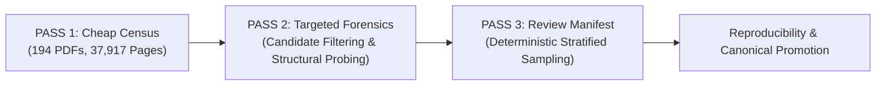

# T0.1 Corpus Gap Audit — Methodology & Technical Specifications

## 1. Executive Summary & Objective

The **T0.1 Corpus Gap Audit** is an evidence-backed, read-only diagnostic investigation of the frozen 194-PDF ARPipe extraction corpus (`dataset/corpus_freeze/`). 
Its core purpose is to:
1. Quantify the exact prevalence and issuer distribution of document and PDF layout/text pathologies.
2. Measure co-occurrence interactions across document conditions and split boundaries.
3. Identify genuine unknowns, rare edge cases, and systemic imbalances.
4. Establish an empirical foundation to decide whether a targeted future acquisition (`T0-GAP`) is justified.

In strict adherence to the project's permanent engineering boundaries, T0.1 does **not** implement extraction algorithms, alter production pipeline behavior (`arpipe/*.py`), download replacement PDFs, or modify frozen T0 baseline artifacts.

---

## 2. Cryptographic Corpus Freeze & Verification Invariants

### 2.1. Corpus Definition & Single-Source Authority
Corpus membership is **exclusively and strictly defined** by the inventory records in:
`dataset/corpus_freeze/corpus_inventory.csv`

The audit does **not** perform recursive disk discovery. Arbitrary PDFs residing in extraneous directories are excluded. For every record in `corpus_inventory.csv`:
1. **Canonical Path Resolution**: The file path is resolved in `live_store/blobs/{sha[:2]}/{sha[2:4]}/{sha}.pdf`.
2. **Existence & Single-Mapping**: The local file must exist, and exactly one physical file on disk must map to that inventory record.
3. **Cryptographic Integrity**: The SHA-256 hash of the local file bytes is computed and verified against `pdf_sha256`. Any discrepancy immediately halts execution.
4. **Historical Missing Cohort**: Exactly 14 historical records possessing ground-truth annotations in legacy logs but lacking local PDF bytes are verified and tagged:
   `HISTORICAL_RECORD_PRESENT`, `PDF_BYTES_UNAVAILABLE`, `NOT_EXECUTABLE_IN_T0.1`.

### 2.2. Page Count Assertion (37,917 Physical Pages)
The frozen T0 baseline reports exactly 37,917 physical pages across the 194 executable PDFs. During Pass 1, each PDF is opened via PyMuPDF (`pymupdf`), its internal page count is checked against `page_count`, and the total physical page count is aggregated. The audit enforces:
$$\sum_{i=1}^{194} \text{pages}(PDF_i) \equiv 37,917$$
Any deviation triggers an immediate audit block.

### 2.3. Frozen T0 Input Artifact Protection
Before execution, the audit hashes all 12 frozen T0 input artifacts using SHA-256 and records them in `dataset/corpus_gap_audit/input_hashes.json`. Following execution, all 12 hashes are re-verified. Any byte-level modification halts the pipeline:
- `corpus_inventory.csv`: `93135febc51638ff3c6d2820e9198ed4eff3f647c68ec494b17213152b2bb2f7`
- `page_profile.csv`: `5bffb19654fe9b868e21ae8eab13543b3f46f9e5753bcc4563f98305fa781dff`
- `issuer_split.csv`: `016e720245577833e8313bb2ec4905b1fb47ba77d15916706b702df4ed1bcc2a`
- `development_manifest.csv`: `518a9c74e8e1d544d10392f0ce61c90e41f81548079708f50c6b7ac8e1d1867f`
- `validation_manifest.csv`: `113b0658bb4973f36fbf61390b8d64273f64a0c801e199d1474870a42b44b631`
- `holdout_manifest.csv`: `a9cf459bc7f916d2c3a648ad54bd6bd6b24697c06fab48df16ebcd5f6e7fcdff`
- `challenge_coverage_manifest.csv`: `b7cdeb3d3d3c2d0b6492a7862cdf54d4c36e27389d8688a98614e0e0be31ba53`
- `annotation_roster.csv`: `b864938920b9452076b4d0da991d52e137f9f9f2155e6ffdf0adff0e0dd4bb00`
- `diversity_matrix.csv`: `236440f9b78ede9d46a02f179e4a2467f2fa85a21f3d699c91b32b69ee726c36`
- `interaction_matrix.csv`: `d3830431e36fc493c2d44861f2dca8a88cedb0a77a08c1333f34f33517ed0fd9`
- `rare_condition_register.csv`: `6306befac8734f54ee2aeaf5d14d298572ebcd5679499585172c0fc665059730`
- `freeze_summary.json`: `08677d7818511b5fbc49111bef5cb96f25eeac0dc5e6a04bf62b95f6b6a96cd1`

---

## 3. Three-Pass Audit Architecture

To balance thoroughness with execution efficiency, the audit implements a structured 3-pass diagnostic pipeline:

### 3.1. PASS 1 — Cheap Census
Executed on all 37,917 pages across all 194 PDFs:
- **Geometry & Dimension**: MediaBox width, height, aspect ratio, and internal page rotation (`page.rotation`).
- **Text & Word Counts**: Raw character count (`len(text)`), tokenized word count.
- **Raster Footprint**: Count of embedded image XObjects, total bounding box coverage, and `image_area_frac` relative to total page area.
- **Script Analysis**: Regex scan for Devanagari Unicode codepoints (`[\u0900-\u097F]`) and Latin characters.
- **Font & Encoding Telemetry**: Extraction of font descriptors, replacement characters (`\uFFFD`), and Private Use Area codepoints (`\uE000-\uF8FF`).
- **Basic Column Layout**: Clustering of horizontal bounding box coordinates of body text blocks outside margin zones.
- **Furniture Candidates**: Isolation of top-margin (top 8%) and bottom-margin (bottom 8%) text blocks.

### 3.2. PASS 2 — Targeted Forensics
Executed selectively on candidate pages identified in Pass 1:
- **Running Furniture Stability**: Multi-page tracking across consecutive pages checking normalized string identity (ignoring variable page numbers) and vertical coordinate alignment ($\Delta y \le 5.0\text{ pt}$).
- **Table Candidates**: Dual-signal probing combining vector line/rectangle grid counts (`page.get_drawings()`) with horizontal alignment of dense numeric tokens ($\ge 3$ columns across $\ge 3$ rows).
- **Text Layer Overlap & Hidden Text**: Sub-block text span comparison calculating bounding box Intersection-over-Union (IoU) to flag exact duplicates ($\text{IoU} \ge 0.70$) and near duplicates ($\text{IoU} \ge 0.40$), alongside sub-point font sizes ($\text{size} < 0.5\text{ pt}$) indicating hidden text.
- **TOC Offset Solver**: Multi-entry candidate folio extraction from table-of-contents pages matched against physical body headings across the entire document.
- **MD&A Complexity & Annexures**: Structural localization of MD&A-like heading phrases, detecting whether they appear in running furniture, body text, or outline bookmarks, and detecting combined MD&A or annexure titles.

### 3.3. PASS 3 — Review Manifest & Verification
- Deterministic stratified selection of 5–10 candidate examples per condition family across diverse issuers, fiscal years, and splits.
- Candidate records default to `verification_status = NOT_REVIEWED`.
- A dedicated model review tool (`tools/apply_model_review.py`) inspects evidence snippets and assigns `MODEL_REVIEWED` with explicit reviewer notes.
- In accordance with task rules, `HUMAN_CONFIRMED` is strictly reserved for human inspection and is **never** emitted automatically.

---

## 4. Evidence Model & Status Definitions

Every T0.1 detector produces **EVIDENCE**, not production truth. A detector signal (e.g. vector lines present, or overlapping bounding box) does not prove semantic correctness.

Two separate fields are tracked for every record:
1. `detector_status`:
   - `CANDIDATE`: The audit detector observed supporting structural or geometric evidence.
   - `NOT_OBSERVED`: The detector observed no candidate signals.
2. `verification_status`:
   - `NOT_REVIEWED`: Generated by automated heuristic detection.
   - `MODEL_REVIEWED`: Inspected by model reasoning with documented evidence notes; not human confirmed.
   - `HUMAN_CONFIRMED`: Verified by visual human inspection.
   - `HUMAN_FALSE_POSITIVE`: Rejected by human review.
   - `HUMAN_UNCERTAIN`: Human reviewer was unable to reach definitive conclusion.

---

## 5. Parameterized Exploratory Heuristics

All thresholds in T0.1 are engineering heuristics, explicitly labelled **EXPLORATORY** and pinned in `configs/audit_config.json` (SHA-256: `8e26bec124a34806fbfe0a0bcb941be15f59e6a56df3e1f92309e00a90d47598`):

| Parameter | Value | Label | Engineering Justification |
| :--- | :--- | :--- | :--- |
| `margin_top_frac` | 0.08 | EXPLORATORY | Standard header margin boundary covering upper 8% of page |
| `margin_bottom_frac` | 0.08 | EXPLORATORY | Standard footer margin boundary covering lower 8% of page |
| `furniture_min_consecutive_pages` | 2 | EXPLORATORY | Minimum repetition across consecutive pages to distinguish running furniture from isolated headings |
| `furniture_y_tolerance_pt` | 5.0 pt | EXPLORATORY | Vertical coordinate tolerance accounting for minor rendering jitter |
| `scanned_page_max_chars` | 20 | EXPLORATORY | Threshold for scanned pages containing minimal residual noise characters |
| `scanned_page_min_image_frac` | 0.85 | EXPLORATORY | Minimum image area fraction indicating full-page raster scan |
| `hybrid_page_min_image_frac` | 0.25 | EXPLORATORY | Minimum image area fraction indicating hybrid text/raster composition |
| `table_min_aligned_columns` | 3 | EXPLORATORY | Minimum tab stops required to form a tabular column structure |
| `table_min_aligned_rows` | 3 | EXPLORATORY | Minimum row count to establish tabular layout |
| `table_numeric_token_min_ratio` | 0.30 | EXPLORATORY | Ratio of numeric/currency tokens distinguishing financial tables from prose |
| `table_vector_grid_min_rects` | 4 | EXPLORATORY | Vector rectangle threshold indicating grid borders |
| `overlap_iou_threshold` | 0.70 | EXPLORATORY | Spatial IoU threshold for exact duplicate text bounding boxes |
| `near_overlap_iou_threshold` | 0.40 | EXPLORATORY | Spatial IoU threshold for near-duplicate/OCR overlay text |
| `hidden_text_max_font_size` | 0.5 pt | EXPLORATORY | Font size threshold indicating deliberately hidden/invisible text |
| `devanagari_page_min_chars` | 1 | EXPLORATORY | Sensitivity threshold to detect any non-Latin Devanagari script |
| `hindi_page_min_devanagari_chars` | 20 | EXPLORATORY | Threshold distinguishing meaningful Hindi prose from isolated glyphs |
| `bilingual_page_min_latin_chars` | 100 | EXPLORATORY | Minimum Latin characters on a bilingual page |
| `bilingual_page_min_devanagari_chars` | 50 | EXPLORATORY | Minimum Devanagari characters on a bilingual page |
| `toc_offset_high_confidence_min_matches` | 3 | EXPLORATORY | Minimum consistent entry-to-heading matches to declare STRONG_CANDIDATE |

---

## 6. Document-Level Aggregation Rules

Page-level observations are aggregated into document-level metrics using explicit, unambiguous logic:

1. **Page Counts**:
   - `native_page_count`: Number of pages with `char_count > 50` and not scanned.
   - `ocr_page_count`: Number of pages with frozen T0 `render_mode_ocr_layer_indicator == True`.
   - `scanned_page_count`: Number of pages with `char_count <= 20` and `image_area_frac >= 0.85`.
   - `legacy_candidate_page_count`: Pages with CID broken font indicator or replacement/PUA codepoints.
   - `hidden_text_candidate_page_count`: Pages with detected sub-point font sizes.
   - `duplicate_text_candidate_page_count`: Pages with overlapping text bounding boxes.
   - `devanagari_page_count`: Pages with $\ge 1$ Devanagari character.
   - `bilingual_candidate_page_count`: Pages with both $\ge 100$ Latin and $\ge 50$ Devanagari characters.
   - `table_candidate_page_count`: Pages exhibiting vector grid lines or aligned numeric tables.
   - `header_candidate_page_count`: Pages containing confirmed running header furniture.
   - `footer_candidate_page_count`: Pages containing confirmed running footer furniture.

2. **Document Representation (`document_representation`)**:
   - `SCANNED`: `scanned_page_count == total_pages`.
   - `NATIVE`: `scanned_page_count == 0` and `ocr_page_count == 0`.
   - `MIXED`: `scanned_page_count > 0` or `ocr_page_count > 0` alongside native pages.
   - `UNKNOWN`: Otherwise.

3. **Long Report Length Classification**:
   Derived empirically from the sorted page count distribution of all 194 PDFs:
   - **Min**: 32 pages
   - **Q1 (25th percentile)**: 92.75 pages
   - **Median (50th percentile)**: 165.00 pages
   - **Mean**: 195.45 pages
   - **Q3 (75th percentile)**: 249.25 pages
   - **P90 (90th percentile)**: 332.80 pages
   - **P95 (95th percentile)**: 411.35 pages
   - **Max**: 661 pages

   **Categories**:
   - `SHORT`: $\text{pages} < 92.75$ (Q1)
   - `MEDIUM`: $92.75 \le \text{pages} \le 249.25$ (Q1 to Q3)
   - `LONG`: $249.25 < \text{pages} \le 332.80$ (Q3 to P90)
   - `VERY_LONG`: $332.80 < \text{pages} \le 411.35$ (P90 to P95)
   - `EXTREME`: $\text{pages} > 411.35$ (> P95)

---

## 7. Multi-Run Reproducibility Protocol

Reproducibility is strictly enforced by `tools/audit_corpus_gap_reproducibility.py`:
1. Two complete, independent runs are executed into isolated directories:
   `dataset/corpus_gap_audit/run_01/` and `dataset/corpus_gap_audit/run_02/`.
2. All 18 substantive CSV and JSON output files are compared via SHA-256 byte hashing.
3. Protected T0 input artifact hashes are verified before run_01, between runs, and after run_02.
4. Only upon complete identity are outputs promoted into the canonical `dataset/corpus_gap_audit/` directory. Variable runtime metadata (`run_timestamp`) is excluded from equality checks.

