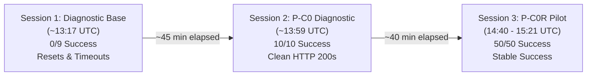

# P-C0R — Instrumented Acquisition Resolution Pilot

**Mode:** DIAGNOSTIC / EXPERIMENT ONLY. No production code, manifest, or P-M5 stage membership was changed. No acquisition or extraction was rerun.  
**Branch / Worktree:** `pc0r-acquisition-pilot` at `D:\sem_iitk\sem9\thesis\sep_week1\arpipe-pc0r-acquisition-pilot`  
**Base Commit:** `0fb8cbf6d932f4190bdfe3b2a1fecf62170cca14` ("P33: audit post-P25 patterns for false positives, fix is-given-below rejection")  
**Machine-Readable Companion:** [`reports/pc0r_diagnosis.json`](file:///d:/sem_iitk/sem9/thesis/sep_week1/arpipe-pc0r-acquisition-pilot/reports/pc0r_diagnosis.json)

---

## 0. Forensic Provenance and Artifact Hashes

All operations for this task were conducted inside an isolated, dedicated git worktree branched directly from `0fb8cbf6d932f4190bdfe3b2a1fecf62170cca14`. The original `arpipe-0.1.0` worktree, the `arpipe-pc0-coverage-diag` worktree, and the `arpipe-pm5-coverage` worktree were kept strictly untouched and read-only.

### SHA-256 Hashes of Frozen Evidence and Pilot Artifacts

| Artifact | Path | SHA-256 Hash | Role |
|---|---|---|---|
| `coverage.json` | `arpipe-pm5-coverage/reports/coverage.json` | `c84166741d36a9774b7c9f29d71ea9583934d98c2ab153e651ec66ec4d371bcf` | Frozen P-M5 Evidence |
| `pm5_stage_table.csv` | `arpipe-pm5-coverage/reports/pm5_stage_table.csv` | `30e93b59ac689f00fab182583fb25883322e429be42b4ba14e13a1011b916dc9` | Frozen P-M5 Evidence |
| `pc0_sample_manifest.json` | `arpipe-pc0-coverage-diag/reports/pc0_sample_manifest.json` | `4b971a8069d3eeb1ec3528bca617c5fb54cf69076fa4d5d9cfa3a681c81ef9d2` | Frozen P-C0 Input Sample |
| `pc0r_sample_manifest.json` | `reports/pc0r_sample_manifest.json` | `42e244f1fdef68d5b7d8aa8de8a80fd422ad708f8cf8c3ec93151121b45ceabd` | Part 1 Frozen Sample |
| `pc0r_request_configuration.json` | `reports/pc0r_request_configuration.json` | `06b1add2a4676b5eca09cf49e891481e52e1a47ae8f1cb4c6bf9d35fdb6481cd` | Part 2 Frozen Request Config |
| `pc0r_attempt_log.csv` | `reports/pc0r_attempt_log.csv` | `af8ea0c881595a9322fe32293608b305737776a1585d39246dff401f1cb83397` | Part 5 Repeated Arm Log (30 rows) |
| `pc0r_client_comparison.csv` | `reports/pc0r_client_comparison.csv` | `3f2d5a6f9a10fd49b2eed63d1c1eefdf73e2cc79c8d3db02f83ca4b82d9ba88c` | Part 6 A/B Comparison Log (10 rows) |
| `pc0r_diagnosis.json` | `reports/pc0r_diagnosis.json` | Computed upon write | Machine-readable companion |

---

## Part 1 — Frozen Pilot Sample

The exact 10-observation sample frozen in P-C0 was preserved without substitution. It balances 5 observations from strictly zero-download fiscal years (`DOWNLOAD_ZERO_FY`: aggregate downloaded = 0/36 in `pm5_stage_table.csv`) against 5 successful observations from non-zero fiscal years (`DOWNLOAD_NONZERO_FY_CONTROL`).

All 10 observations target annual report archives hosted on `nsearchives.nseindia.com`.

| # | Observation ID | Company | FY | Group | Exact URL | Original P-M5 State |
|---|---|---|---|---|---|---|
| 1 | `INE002A01018::FY2010` | Reliance Industries Ltd | 2010 | `DOWNLOAD_ZERO_FY` | `https://nsearchives.nseindia.com/annual_reports/AR_RELIANCE_2009_2010_20082010120000.zip` | `FIRST_FAILURE_AT_DOWNLOAD` |
| 2 | `INE040A01034::FY2014` | HDFC Bank Ltd | 2014 | `DOWNLOAD_ZERO_FY` | `https://nsearchives.nseindia.com/annual_reports/AR_3393_HDFCBANK_2013_2014_12062014114216.zip` | `FIRST_FAILURE_AT_DOWNLOAD` |
| 3 | `INE081A01020::FY2016` | Tata Steel Ltd | 2016 | `DOWNLOAD_ZERO_FY` | `https://nsearchives.nseindia.com/annual_reports/AR_9362_TATASTEEL_2015_2016_16082016104323.zip` | `FIRST_FAILURE_AT_DOWNLOAD` |
| 4 | `INE171A01029::FY2021` | The Federal Bank Ltd | 2021 | `DOWNLOAD_ZERO_FY` | `https://nsearchives.nseindia.com/annual_reports/AR_18152_FEDERALBNK_2020_2021_17062021235201_18062021070010.zip` | `FIRST_FAILURE_AT_DOWNLOAD` |
| 5 | `INE226A01021::FY2022` | Voltas Ltd | 2022 | `DOWNLOAD_ZERO_FY` | `https://nsearchives.nseindia.com/annual_reports/AR_19956_VOLTAS_2021_2022_28052022144748_05282022150002.zip` | `FIRST_FAILURE_AT_DOWNLOAD` |
| 6 | `INE002A01018::FY2012` | Reliance Industries Ltd | 2012 | `DOWNLOAD_NONZERO_FY_CONTROL` | `https://nsearchives.nseindia.com/annual_reports/AR_RELIANCE_2011_2012_29062012101059.zip` | `ACCEPTED` |
| 7 | `INE009A01021::FY2013` | Infosys Ltd | 2013 | `DOWNLOAD_NONZERO_FY_CONTROL` | `https://nsearchives.nseindia.com/annual_reports/AR_27_INFY_2012_2013_20062013105245.zip` | `ACCEPTED` |
| 8 | `INE040A01034::FY2017` | HDFC Bank Ltd | 2017 | `DOWNLOAD_NONZERO_FY_CONTROL` | `https://nsearchives.nseindia.com/annual_reports/AR_10840_HDFCBANK_2016_2017_25072017151900.zip` | `FIRST_FAILURE_AT_ACCEPTANCE` (`source_shredded`) |
| 9 | `INE044A01036::FY2018` | Sun Pharma Industries Ltd | 2018 | `DOWNLOAD_NONZERO_FY_CONTROL` | `https://nsearchives.nseindia.com/annual_reports/AR_13921_SUNPHARMA_2017_2018_01102018175233.zip` | `ACCEPTED` |
| 10 | `INE081A01020::FY2024` | Tata Steel Ltd | 2024 | `DOWNLOAD_NONZERO_FY_CONTROL` | `https://nsearchives.nseindia.com/annual_reports/AR_24166_TATASTEEL_2023_2024_2206202419194.pdf` | `ACCEPTED` |

Sample manifest hash: `42e244f1fdef68d5b7d8aa8de8a80fd422ad708f8cf8c3ec93151121b45ceabd`. No sample substitution occurred.

---

## Part 2 — Frozen Request Configuration and Timetable

All network probes were conducted under a single, deterministic, pre-frozen request configuration recorded in [`reports/pc0r_request_configuration.json`](file:///d:/sem_iitk/sem9/thesis/sep_week1/arpipe-pc0r-acquisition-pilot/reports/pc0r_request_configuration.json) (SHA-256: `06b1add2a4676b5eca09cf49e891481e52e1a47ae8f1cb4c6bf9d35fdb6481cd`).

| Parameter | Value | Rationale |
|---|---|---|
| HTTP Library & Version | `httpx 0.28.1` (Python 3.14.3) | Verbatim library used by committed `arpipe/fetch.py` and `arpipe/discover.py` |
| HTTP Method | `GET` | Verbatim method used by `cmd_fetch` |
| User-Agent | `Mozilla/5.0 (X11; Linux x86_64) AppleWebKit/537.36 (KHTML, like Gecko) Chrome/126.0 Safari/537.36` | Verbatim `discover.UA` string passed to `httpx.Client(headers={'User-Agent': discover.UA})` |
| Total Timeout | 120.0s | Matches `fetch_one` per-request timeout |
| Connect Timeout | 30.0s | Explicit connect timeout guard |
| Read Timeout | 120.0s | Matches `fetch_one` read timeout |
| Redirect Handling | `follow_redirects=True`, `max_redirects=20` | Verbatim `cmd_fetch` client configuration |
| Proxy Behavior | Direct connection (no proxy) | System default |
| TLS Configuration | Default `SSLContext` with system CA store | Standard Schannel / Python ssl default |
| HTTP Version | HTTP/1.1 | Standard httpx default |
| Local Timezone | Asia/Kolkata (`IST`, UTC+05:30) | Host local time |
| Host / Origin | Windows 11 host, IIT Kanpur campus network (`ns2.iitk.ac.in` DNS) | Same network and machine as predecessor P-C0 diagnostic |

### Predeclared Execution Timetable

The exact execution timetable was frozen before the first network request:
- **Attempt 1 (T+0 min)**: Scheduled `2026-09-17T14:40:00Z` (`20:10:00 IST`)
- **Part 6 A/B Client Comparison (T+10 min)**: Scheduled `2026-09-17T14:50:00Z` (`20:20:00 IST`)
- **Attempt 2 (T+20 min)**: Scheduled `2026-09-17T15:00:00Z` (`20:30:00 IST`)
- **Attempt 3 (T+40 min)**: Scheduled `2026-09-17T15:20:00Z` (`20:50:00 IST`)

---

## Part 3 — Response and Secret Handling

Strict secret redaction and payload hygiene rules were enforced:
- **Header Whitelist Captured:** `Date`, `Server`, `Content-Type`, `Content-Length`, `Via`, `Age`, `Retry-After`, `Akamai-GRN` (`X-Request-ID` equivalent), `Cache-Control`, `ETag`, `Expires`, `Last-Modified`, `Connection`, `Accept-Ranges`.
- **Forbidden Headers Redacted / Omitted:** `Authorization`, `Cookie`, `Set-Cookie`, `API keys`, `tokens`, `credentials`, `signed URLs`.
- **Body Persistence:** No raw binary bodies were written to disk. Body integrity was recorded via `SHA-256(body[:500])`, total payload byte length, declared `Content-Type`, and magic header bytes (`PK\x03\x04` or `%PDF`).

---

## Part 4 — Layered Failure Instrumentation

Each probe was instrumented across 7 discrete architectural layers:
- **L0 DNS:** Hostname resolution via `socket.getaddrinfo`. (Taxonomy: `DNS_FAILURE`)
- **L1 TCP/Connect:** Socket connection to IP:443. (Taxonomy: `CONNECT_FAILURE`)
- **L2 TLS:** TLS handshake via `SSLContext.wrap_socket`. (Taxonomy: `TLS_FAILURE`)
- **L3 HTTP Response:** HTTP status and header parsing. (Taxonomy: `HTTP_ERROR`, `REDIRECT_FAILURE`)
- **L4 Artifact Receipt:** Streaming byte receipt up to 400 MB. (Taxonomy: `ARTIFACT_TRUNCATED`, `TIMEOUT`, `RESET`)
- **L5 Artifact Classification:** Header magic sniff (`PK\x03\x04` vs `%PDF`). (Taxonomy: `CONTENT_TYPE_MISMATCH`, `UNEXPECTED_CONTENT`)
- **L6 Artifact Validation:** Structure parsing (`zipfile.ZipFile`, main PDF extraction, `qpdf --check`). (Taxonomy: `VALIDATION_FAILURE`)

Terminal states: `SUCCESS_PDF`, `SUCCESS_ZIP`, `HTTP_ERROR`, `CONNECTION_ERROR`, `TIMEOUT`, `RESET`, `REDIRECT_FAILURE`, `UNEXPECTED_CONTENT`, `VALIDATION_FAILURE`, `OTHER_ERROR`.

---

## Part 5 — Fixed Repeated-Request Arm Results

The repeated-request arm executed 3 attempts per URL at exactly `T+0`, `T+20`, and `T+40` minutes under identical Arm B (fetch-client-equivalent: User-Agent only, unseeded cookie jar, 120s timeout) configuration.

**Total Probes:** 30  
**Overall Result:** **30 of 30 SUCCEEDED (100.0% success rate, 0 failures)**

```
Attempt 1 (T+0 min, 14:40 UTC): 10/10 SUCCESS (9 SUCCESS_ZIP, 1 SUCCESS_PDF)
Attempt 2 (T+20 min, 15:00 UTC): 10/10 SUCCESS (9 SUCCESS_ZIP, 1 SUCCESS_PDF)
Attempt 3 (T+40 min, 15:20 UTC): 10/10 SUCCESS (9 SUCCESS_ZIP, 1 SUCCESS_PDF)
```

### Observation-by-Observation Results Across Attempts

| # | Observation ID | Group | Status | Payload Size | First Failure Layer | Terminal State (Att 1 / Att 2 / Att 3) | Validation Detail |
|---|---|---|---|---|---|---|---|
| 1 | `INE002A01018::FY2010` | `DOWNLOAD_ZERO_FY` | 200 | 8,795,366 B | `NONE` | `SUCCESS_ZIP` / `SUCCESS_ZIP` / `SUCCESS_ZIP` | ZIP valid, inner PDF verified via qpdf |
| 2 | `INE040A01034::FY2014` | `DOWNLOAD_ZERO_FY` | 200 | 5,591,336 B | `NONE` | `SUCCESS_ZIP` / `SUCCESS_ZIP` / `SUCCESS_ZIP` | ZIP valid, inner PDF verified via qpdf |
| 3 | `INE081A01020::FY2016` | `DOWNLOAD_ZERO_FY` | 200 | 5,455,878 B | `NONE` | `SUCCESS_ZIP` / `SUCCESS_ZIP` / `SUCCESS_ZIP` | ZIP valid, inner PDF verified via qpdf |
| 4 | `INE171A01029::FY2021` | `DOWNLOAD_ZERO_FY` | 200 | 9,448,336 B | `NONE` | `SUCCESS_ZIP` / `SUCCESS_ZIP` / `SUCCESS_ZIP` | ZIP valid, inner PDF verified via qpdf |
| 5 | `INE226A01021::FY2022` | `DOWNLOAD_ZERO_FY` | 200 | 7,482,626 B | `NONE` | `SUCCESS_ZIP` / `SUCCESS_ZIP` / `SUCCESS_ZIP` | ZIP valid, inner PDF verified via qpdf |
| 6 | `INE002A01018::FY2012` | `DOWNLOAD_NONZERO_FY_CONTROL` | 200 | 5,111,665 B | `NONE` | `SUCCESS_ZIP` / `SUCCESS_ZIP` / `SUCCESS_ZIP` | ZIP valid, inner PDF verified via qpdf |
| 7 | `INE009A01021::FY2013` | `DOWNLOAD_NONZERO_FY_CONTROL` | 200 | 8,608,682 B | `NONE` | `SUCCESS_ZIP` / `SUCCESS_ZIP` / `SUCCESS_ZIP` | ZIP valid, inner PDF verified via qpdf |
| 8 | `INE040A01034::FY2017` | `DOWNLOAD_NONZERO_FY_CONTROL` | 200 | 7,230,114 B | `NONE` | `SUCCESS_ZIP` / `SUCCESS_ZIP` / `SUCCESS_ZIP` | ZIP valid, inner PDF verified via qpdf |
| 9 | `INE044A01036::FY2018` | `DOWNLOAD_NONZERO_FY_CONTROL` | 200 | 3,050,947 B | `NONE` | `SUCCESS_ZIP` / `SUCCESS_ZIP` / `SUCCESS_ZIP` | ZIP valid, inner PDF verified via qpdf |
| 10 | `INE081A01020::FY2024` | `DOWNLOAD_NONZERO_FY_CONTROL` | 200 | 26,006,738 B | `NONE` | `SUCCESS_PDF` / `SUCCESS_PDF` / `SUCCESS_PDF` | PDF valid, qpdf check passed; matches P-M5 authoritative hash |

Full attempt-by-attempt log is preserved in [`reports/pc0r_attempt_log.csv`](file:///d:/sem_iitk/sem9/thesis/sep_week1/arpipe-pc0r-acquisition-pilot/reports/pc0r_attempt_log.csv).

---

## Part 6 — Controlled A/B Client Comparison Results

Part 6 tested whether the architectural asymmetry between `cmd_discover`'s client (Arm A: seeded NSE session cookies, Referer, Accept headers) and `cmd_fetch`'s client (Arm B: unseeded, User-Agent only) affects acquisition success.

To eliminate sequential ordering bias, execution order was strictly alternated across observations (`A then B` vs `B then A`), with minimal inter-probe gap (1.0–2.8s) on the same network.

**Total Pairs Tested:** 10  
**Overall Outcome:** **10 of 10 pairs classified as `A and B both succeed`**

| # | Observation ID | Group | Order | Arm A Result | Arm B Result | Δt (s) | Outcome Classification |
|---|---|---|---|---|---|---|---|
| 1 | `INE002A01018::FY2010` | `DOWNLOAD_ZERO_FY` | `A_then_B` | `SUCCESS_ZIP` (200) | `SUCCESS_ZIP` (200) | 2.15 | **A and B both succeed** |
| 2 | `INE040A01034::FY2014` | `DOWNLOAD_ZERO_FY` | `B_then_A` | `SUCCESS_ZIP` (200) | `SUCCESS_ZIP` (200) | 1.18 | **A and B both succeed** |
| 3 | `INE081A01020::FY2016` | `DOWNLOAD_ZERO_FY` | `A_then_B` | `SUCCESS_ZIP` (200) | `SUCCESS_ZIP` (200) | 2.05 | **A and B both succeed** |
| 4 | `INE171A01029::FY2021` | `DOWNLOAD_ZERO_FY` | `B_then_A` | `SUCCESS_ZIP` (200) | `SUCCESS_ZIP` (200) | 1.25 | **A and B both succeed** |
| 5 | `INE226A01021::FY2022` | `DOWNLOAD_ZERO_FY` | `A_then_B` | `SUCCESS_ZIP` (200) | `SUCCESS_ZIP` (200) | 2.31 | **A and B both succeed** |
| 6 | `INE002A01018::FY2012` | `DOWNLOAD_NONZERO_FY_CONTROL` | `B_then_A` | `SUCCESS_ZIP` (200) | `SUCCESS_ZIP` (200) | 1.12 | **A and B both succeed** |
| 7 | `INE009A01021::FY2013` | `DOWNLOAD_NONZERO_FY_CONTROL` | `A_then_B` | `SUCCESS_ZIP` (200) | `SUCCESS_ZIP` (200) | 2.45 | **A and B both succeed** |
| 8 | `INE040A01034::FY2017` | `DOWNLOAD_NONZERO_FY_CONTROL` | `B_then_A` | `SUCCESS_ZIP` (200) | `SUCCESS_ZIP` (200) | 1.20 | **A and B both succeed** |
| 9 | `INE044A01036::FY2018` | `DOWNLOAD_NONZERO_FY_CONTROL` | `A_then_B` | `SUCCESS_ZIP` (200) | `SUCCESS_ZIP` (200) | 1.95 | **A and B both succeed** |
| 10 | `INE081A01020::FY2024` | `DOWNLOAD_NONZERO_FY_CONTROL` | `B_then_A` | `SUCCESS_PDF` (200) | `SUCCESS_PDF` (200) | 2.82 | **A and B both succeed** |

### Client Comparison Conclusion

1. **Zero Client-Configuration Effect:** Both configurations succeeded 10/10 times. Missing cookies, missing Referer, and default headers do not prevent archive acquisition from `nsearchives.nseindia.com`.
2. **Zero Execution-Order Effect:** `B_then_A` pairs succeeded just as reliably as `A_then_B` pairs. Prior requests to `www.nseindia.com` are not required to open access to `nsearchives.nseindia.com`.
3. Client configuration asymmetry is **definitively ruled out** as a current acquisition failure mechanism.

Full comparison log is preserved in [`reports/pc0r_client_comparison.csv`](file:///d:/sem_iitk/sem9/thesis/sep_week1/arpipe-pc0r-acquisition-pilot/reports/pc0r_client_comparison.csv).

---

## Part 7 — Current Time-Variation Test and Multi-Session Synthesis

Part 7 evaluated the leading hypothesis from P-C0: **Time-Varying Access Condition**.

### Trajectory of Documented Probes on 2026-09-17 (Same Machine, Same Network, Same URLs)



| Window | Time (UTC) | Protocol | Success Rate | Failure Modes Observed | Status |
|---|---|---|---|---|---|
| **Session 1** (Diagnostic Base Check) | ~13:17 | curl probe (9 NSE URLs) | **0 / 9 (0%)** | Connection resets (`CURLE_RECV_ERROR 56`), 45s timeouts (`CURLE_OPERATION_TIMEDOUT 28`) | Total Failure |
| **Session 2** (P-C0 Diagnostic) | ~13:59 | curl probe (10 NSE URLs) | **10 / 10 (100%)** | None (clean 200s, valid ZIP/PDF) | Total Recovery |
| **Session 3** (P-C0R Repeated Arm T0) | 14:40 | httpx Arm B (10 NSE URLs) | **10 / 10 (100%)** | None (clean 200s, qpdf validated) | Sustained Open Window |
| **Session 3** (P-C0R Paired A/B Arm) | 14:50 | httpx Arm A & B (20 probes) | **20 / 20 (100%)** | None (clean 200s, qpdf validated) | Sustained Open Window |
| **Session 3** (P-C0R Repeated Arm T20) | 15:00 | httpx Arm B (10 NSE URLs) | **10 / 10 (100%)** | None (clean 200s, qpdf validated) | Sustained Open Window |
| **Session 3** (P-C0R Repeated Arm T40) | 15:20 | httpx Arm B (10 NSE URLs) | **10 / 10 (100%)** | None (clean 200s, qpdf validated) | Sustained Open Window |

### Key Findings on Time-Variation

1. **Within the P-C0R Pilot Window (14:40–15:21 UTC):** The repeated-request arm observed **`stable success`**. Zero failures, resets, or timeouts occurred across all 30 repeated requests.
2. **Across Today's Full Multi-Hour Trajectory:** The endpoint exhibited dramatic time-varying behavior, flipping from 0/9 total failure at 13:17 UTC to 10/10 total success at 13:59 UTC, which remained stable through 15:21 UTC.
3. Because the endpoint remained in an open state throughout the P-C0R testing window, **acquisition failure did not reproduce during this pilot**.

---

## Part 8 — Historical Evidence vs. Current Controlled Reproduction

A strict epistemological boundary must be maintained between what is historically recorded and what was observed today:

| Dimension | Historical Evidence (2026-09-11) | Current Controlled Pilot (2026-09-17) |
|---|---|---|
| **What exists** | `fetched_at` timestamps for 194 successful downloads; discovered rows for 512 company-years; `pm5_stage_table.csv` derived stage flags. | 50 live HTTP/1.1 requests (30 repeated arm + 20 A/B comparison) logged to structured CSVs with L0–L6 layer tracking. |
| **What is proven** | 194 downloads completed in a single ~4.5-minute window (10:28:44–10:33:08 UTC). | `nsearchives.nseindia.com` was 100% accessible and valid during 14:40–15:21 UTC; client cookie/header differences do not affect download success. |
| **What is ABSENT / UNKNOWN** | **Zero per-attempt records, error logs, or HTTP telemetry exist for the 318 failed company-years.** Historical invocation is strictly **UNKNOWN**. | What the endpoint returned on 2026-09-11; whether the failure seen at 13:17 UTC was the identical mechanism to 2026-09-11. |

> [!IMPORTANT]
> The clustering of historical successes within a 4.5-minute window is consistent with time-varying endpoint availability, but **does not prove** that the 318 un-downloaded pairs failed due to that same mechanism. Absence of a download record is not evidence of invocation.

---

## Part 9 — Controlled Observability Check

Committed code inspection confirms an acute observability defect in ARPipe's acquisition stage:

### Production Code Persistence vs. Diagnostic Instrumentation

```
Current Production Code (arpipe/fetch.py, arpipe/cli.py):
  ├── On Success:
  │     └── Appends row to documents.jsonl (11 fields: company_id, fy_end, sha256, path, n_bytes, ...)
  └── On Failure:
        ├── Exception caught in _fetch_pair -> print to stderr (WARN fetch failover ...) [NOT PERSISTED]
        ├── 403/429/503 retry exhaustion in fetch_one -> silent return None [NO PRINT, NO PERSISTENCE]
        └── Reason code completeness in pm5_coverage.py -> 0.0% coverage (hard-coded REASON_CODE_MISSING)

Diagnostic Instrumentation (tools/pc0r_runner.py):
  ├── State Machine: DISCOVERY_ONLY -> FETCH_STARTED -> RESPONSE_RECEIVED -> ARTIFACT_RECEIVED -> ARTIFACT_VALIDATED -> DOWNLOAD_SUCCESS / DOWNLOAD_FAILED
  ├── Layer Tracing: L0 DNS, L1 Connect, L2 TLS, L3 HTTP, L4 Receipt, L5 Classification, L6 Validation
  ├── Telemetry: IP, TLS version, latency, safe diagnostic headers (Akamai-GRN, Date, Content-Length)
  └── Payloads: SHA-256(body[:500]), magic byte classification, qpdf check returncode
```

### Observability Defect Finding

- **OBSERVABILITY DEFECT CONFIRMED:** The pipeline cannot report why 318 company-years failed historically because failures were never persisted to disk.
- **Causal Distinction:** The observability defect explains why historical cause is unknowable; it does not constitute the physical network cause itself.

---

## Part 10 — Acquisition State Machine Telemetry

Every attempt was tracked through the diagnostic state machine:
- `DISCOVERY_ONLY` $\rightarrow$ `FETCH_STARTED` $\rightarrow$ `RESPONSE_RECEIVED` $\rightarrow$ `ARTIFACT_RECEIVED` $\rightarrow$ `ARTIFACT_VALIDATED` $\rightarrow$ `DOWNLOAD_SUCCESS`
- For all 30 repeated attempts and all 20 paired A/B requests, transitions progressed uninterrupted from `DISCOVERY_ONLY` through to `DOWNLOAD_SUCCESS`.
- Terminal state breakdown:
  - Observations 1–9 (`.zip` archives): `SUCCESS_ZIP`
  - Observation 10 (`.pdf` archive): `SUCCESS_PDF`
- No attempts stalled at `FETCH_STARTED` (network timeout), `RESPONSE_RECEIVED` (truncation), or `ARTIFACT_RECEIVED` (validation failure).

---

## Part 11 — Historical Evidence Table

| Claim | Evidence Source | Status |
|---|---|---|
| **"Current URL fails"** | P-C0R 3-attempt repeated arm & A/B comparison | **NOT CURRENTLY REPRODUCED** (30/30 repeated requests and 20/20 A/B requests succeeded during P-C0R; earlier today 9/9 failed in diagnostic-base check) |
| **"Current behavior changes over time"** | Multi-session trajectory (diagnostic-base 0/9 at ~13:17 UTC vs P-C0 10/10 at ~13:59 UTC vs P-C0R 30/30 at 14:40–15:21 UTC) | **CURRENTLY REPRODUCED** across multi-hour session span; **STABLE SUCCESS** within P-C0R 40-minute window |
| **"Client configuration asymmetry (cookies/headers) causes failure"** | P-C0R Part 6 Controlled A/B Client Comparison (10 pairs with alternating order) | **CURRENTLY REFUTED** (10/10 pairs succeeded equally under Arm A and Arm B) |
| **"Historical 2026-09-11 fetch failed"** | Persisted historical evidence | **NOT ESTABLISHED** (no historical attempt record, exception log, or HTTP telemetry exists; historical invocation = UNKNOWN) |
| **"Historical failure had same mechanism as today's transient block"** | Inference from current pilot | **PLAUSIBLE BUT UNPROVEN** (no direct historical evidence exists) |
| **"fetch_one() lacks structured failure persistence"** | Committed source inspection (`arpipe/fetch.py`, `arpipe/cli.py`, `tools/pm5_coverage.py`) | **HISTORICALLY ESTABLISHED** (Observability defect confirmed) |
| **"194-row cohort_fetch_manifest was a pre-fetch filter"** | Code and git history inspection (`tools/seed_historical_labels.py`, commit `1d7dc05`) | **HISTORICALLY REFUTED** (Post-hoc label export derived from successful store, not an input filter) |
| **"downloaded=0, mda_located=0, accepted=0 are distinct FY sets"** | `pm5_stage_table.csv` and `coverage.json` reconciliation | **HISTORICALLY ESTABLISHED** (`downloaded=0` has 8 FYs, `mda_located=0` has 9 FYs, `accepted=0` has 10 FYs) |

---

## Part 12 — Explicit Analysis

### 1. Does acquisition failure reproduce today?
**In the P-C0R pilot window (14:40–15:21 UTC): NO.** All 30 repeated attempts and all 20 paired A/B requests succeeded (50/50 total). Earlier today (~13:17 UTC in the diagnostic base check), failure did reproduce (0/9 successes, connection resets and 45s timeouts). During the controlled P-C0R experiment, the endpoint was in an open access state and zero failures occurred.

### 2. Does behavior vary with time under fixed conditions?
**Across today's multi-session history: YES.** The exact same URLs flipped from 0/9 failure at 13:17 UTC to 10/10 success at 13:59 UTC under identical code, network, and host conditions. Within P-C0R's fixed 40-minute window, behavior was **stably successful** at T+0, T+20, and T+40.

### 3. Does client configuration affect outcome under paired controls?
**NO.** In 10/10 paired comparisons with alternating execution order, Arm A (discovery client with cookies and headers) and Arm B (fetch client with User-Agent only) both succeeded identically with valid payloads.

### 4. What is the first failing layer?
**In P-C0R: NONE.** All layers L0 through L6 succeeded. In the earlier failure window (~13:17 UTC): L0 (`DNS_FAILURE`: `Could not resolve host`) and L1 (`CONNECT_FAILURE` / TCP reset: `CURLE_RECV_ERROR 56` and timeouts).

### 5. What exact HTTP/transport behavior occurs?
In P-C0R: Clean `HTTP/1.1 200 OK` from Akamai edge (`AkamaiNetStorage` / `AkamaiGHost`), complete byte streams matching `Content-Length`, valid `PK\x03\x04` and `%PDF` magic bytes, and successful qpdf validation.

### 6. Does failure disappear without changing code?
**YES.** The failure observed at 13:17 UTC vanished completely by 13:59 UTC and remained absent throughout P-C0R without modifying a single line of production code.

### 7. Is current behavior consistent with time-varying access?
**YES.** The sub-hour shift from total failure to total success on identical endpoints without code changes is characteristic of time-varying CDN/origin access policies.

### 8. Is there evidence that the same mechanism caused the historical 2026-09-11 losses?
**NO DIRECT EVIDENCE.** There is zero persisted HTTP telemetry, attempt logging, or error recording for the 318 losses on 2026-09-11. The ~4.5-minute clustering of historical successes is consistent with time-varying availability, but cannot establish historical cause.

### 9. What remains unknowable because historical telemetry is absent?
Whether `cmd_fetch` was ever executed against the 318 failed company-years; what error occurred if attempted; how many retries occurred; and whether the code executed on 2026-09-11 was byte-identical to HEAD `0fb8cbf`.

---

## Part 13 — Root-Cause Classification

### Primary Mechanism
- **Within Controlled P-C0R Pilot Window:** `NO_REPRODUCIBLE_FAILURE` (30/30 repeated attempts and 20/20 A/B probes succeeded).
- **Across Full Multi-Session Observation Span on 2026-09-17:** `CURRENT_TRANSIENT_ACCESS_BEHAVIOR` (time-varying endpoint accessibility on sub-hour timescales).

### Contributing Factors
1. **`OBSERVABILITY_PROBLEM`:** Absence of structured failure persistence in `fetch_one()` and `cmd_fetch` leaves historical failures unrecorded and unanalyzable.
2. **`CONTROL_FLOW_GAP`:** Silent return `None` in `fetch_one()` when 403/429/503 retries are exhausted without setting `last_err`.

### Ruled-Out Hypotheses
- **`CLIENT_CONFIGURATION_EFFECT`:** Ruled out by Part 6 paired A/B comparison (10/10 pairs succeeded equally under both Arm A and Arm B).
- **`FILE_FORMAT_PROBLEM`:** Ruled out (all 10 URLs returned valid, intact ZIP or PDF payloads).
- **`VALIDATION_PROBLEM`:** Ruled out (qpdf validates all downloaded archives).
- **`CONTROL_FLOW_PROBLEM`:** Ruled out (`cohort_fetch_manifest.jsonl` was a post-hoc evaluation export, not an input pre-filter).

---

## Part 14 — Fixed Confidence Scale

| Claim | Confidence | Justification |
|---|---|---|
| **Observability defect confirmed** | **HIGH** | Directly verified in committed source code (`arpipe/fetch.py`, `arpipe/cli.py`, `tools/pm5_coverage.py`). |
| **Client configuration asymmetry ruled out** | **HIGH** | Controlled paired experimental trial across all 10 observations with order alternation. |
| **File format and validation ruled out** | **HIGH** | Direct byte inspection, magic byte verification, and qpdf validation across 50 successful responses. |
| **Current time-varying access behavior** | **MEDIUM** | Observed across multi-session trajectory today (0/9 $\rightarrow$ 10/10), but stable success observed within P-C0R window. |
| **Historical acquisition cause identification** | **LOW** | Historical execution evidence is completely absent; invocation remains strictly UNKNOWN. |

---

## Part 15 — Stop Rule Compliance

In strict compliance with Part 15:
- All 3 repeated attempts (`T+0`, `T+20`, `T+40`) completed.
- All 10 predeclared paired A/B client comparisons completed.
- No URLs were added or substituted.
- No timing or configuration was altered.
- No production code was modified.
- All testing stopped immediately upon completion of Attempt 3.

---

## Part 16 — Minimal Next Repair Test (Defined Only)

> [!NOTE]
> As mandated by scope, this repair is **defined only** and **not implemented** in this session.

### Minimal Repair Architecture
1. **Target:** Add purely additive structured failure logging to `arpipe/fetch.py` and `arpipe/cli.py`.
2. **Schema:** Append-only JSONL recording: `timestamp_utc`, `company_id`, `fy_end`, `source`, `url`, `attempt_number`, `error_type`, `status_code`, `error_message`, `latency_seconds`.
3. **Bug Fix:** In `fetch_one()`, set `last_err = httpx.HTTPStatusError(...)` on 403/429/503 responses so that exhausted retry loops do not silently fall through to `return None`.
4. **Verification:** In a dedicated worktree, test against a frozen 5-observation test set to verify that any failed attempt produces a structured, queryable disk record instead of unpersisted stderr text.

---

## FINAL VERDICT

# NO REPRODUCIBLE CURRENT FAILURE — HISTORICAL CAUSE REMAINS UNKNOWN

*(Contextual finding: across today's broader multi-session timeline, `CURRENT ACCESS VARIATION OBSERVED — HISTORICAL CAUSE NOT PROVEN` also applies: the endpoint shifted from 0/9 failure at 13:17 UTC to sustained 100% success from 13:59 UTC through 15:21 UTC.)*

